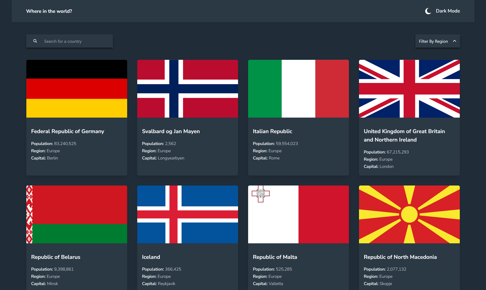

# Frontend Mentor - REST Countries API with color theme switcher solution

This is a solution to the [REST Countries API with color theme switcher challenge on Frontend Mentor](https://www.frontendmentor.io/challenges/rest-countries-api-with-color-theme-switcher-5cacc469fec04111f7b848ca). Frontend Mentor challenges help you improve your coding skills by building realistic projects.

## Table of contents

- [Frontend Mentor - REST Countries API with color theme switcher solution](#frontend-mentor---rest-countries-api-with-color-theme-switcher-solution)
  - [Table of contents](#table-of-contents)
  - [Overview](#overview)
    - [The challenge](#the-challenge)
    - [Screenshot](#screenshot)
    - [Links](#links)
  - [My process](#my-process)
    - [Built with](#built-with)
    - [What I learned](#what-i-learned)
    - [Continued development](#continued-development)
    - [Installation](#installation)
  - [Author](#author)

## Overview

### The challenge

Users should be able to:

- See all countries from the API on the homepage
- Search for a country using an `input` field
- Filter countries by region
- Click on a country to see more detailed information on a separate page
- Click through to the border countries on the detail page
- Toggle the color scheme between light and dark mode *(optional)*

### Screenshot



### Links

- Solution URL: [Github](https://github.com/mostafa-meerzad/rest-countries.git)
- Live Site URL: [Netlify](https://bespoke-tarsier-7a35bf.netlify.app)

## My process

### Built with

- Semantic HTML5 markup
- [Tailwindcss](https://tailwindcss.com/) css framework
- Framer motion
- Axios
- [React](https://reactjs.org/) - JS library

### What I learned

This project was a good challenge to learn about data-fetching, custom hooks, dealing with different image sizes, toggling light/dark mode with tailwindcss.

All and all this was a fun project 👌.

custom hook to fetch data and notify the hook user about the results.

```js

import { useEffect } from "react";
import { useState } from "react";
import { getAllCountries, getCountry } from "../services/apiServices";

export const useCountries = () => {
  const [countries, setCountries] = useState([]);
  const [isLoading, setIsLoading] = useState(true);
  const [error, setError] = useState(null);

  const fetchData = async () => {
    try {
      const data = await getAllCountries();
      setCountries(data);
    } catch (error) {
      setError(error);
    } finally {
      setIsLoading(false);
    }
  };

  const filterCountries = async (filter) => {
    setIsLoading(true);
    try {
      const data = await getAllCountries();
      const filtered = data.filter(
        (country) => country.region.toLowerCase() === filter.toLowerCase()
      );
      setCountries(filtered);
    } catch (error) {
      setError(error);
    } finally {
      setIsLoading(false);
    }
  };

  const searchCountry = async (name) => {
    // do nothing if there is no name provided
    if (!name) return;
    // reset the error if the user calls again after an error occurred
    setError("");
    setIsLoading(true);
    try {
      const data = await getCountry(name);
      setCountries(data);
    } catch (error) {
      setError(true);
    } finally {
      setIsLoading(false);
    }
  };

  useEffect(() => {
    fetchData();
  }, []);

  return { countries, isLoading, error, filterCountries, searchCountry };
};

```

custom hook to toggle theme manually and remember the user choice for the next time they come back with tailwindcss

```js
import { useEffect, useState } from "react";

export const useTheme = () => {
  const initialTheme = localStorage.theme;
  const [theme, setTheme] = useState(initialTheme);

  const toggleTheme = () => {
    if (theme === "dark") {
      setTheme(() => {
        localStorage.theme = "light";
        document.documentElement.classList.remove("dark");
        return "light";
      });
    } else {
      setTheme(() => {
        localStorage.theme = "dark";
        document.documentElement.classList.add("dark");
        return "dark";
      });
    }
  };

  useEffect(() => {
    // check the user's system preferred theme and then toggle the theme
    if (
      localStorage.theme === "dark" ||
      (!("theme" in localStorage) &&
        window.matchMedia("(prefers-color-scheme: dark)").matches)
    ) {
      document.documentElement.classList.add("dark");
    } else {
      document.documentElement.classList.remove("dark");
    }
  }, []);

  return { theme, toggleTheme };
};
```

### Continued development

I would like to work on country-preview page border countries section, in the challenge is mentioned that the user should be able to click a border country and perhaps show some information about it.
For now i'm in a time crunch and probably get this part done in the near future.

### Installation

1. Clone/download the project code from Github.
2. extract files if you downloaded the code. otherwise skip to the next step.
3. Go in the main/root directory of the project.
4. Open up a terminal window and run the following commands.
   1. `npm install`  install project dependencies.
   2. `npm run dev`  start dev server to get the project running locally and play around.
5. You have successfully got the project on your machine.

## Author

- Linkedin - [mostafa-meerzad](https://linkedin.com/in/mostafa-meerzad-a753371b7)
- Github - [mostafa-meerzad](https://github.com/mostafa-meerzad)
- Frontend-mentor - [mostafa-meerzad](https://www.frontendmentor.io/profile/mostafa-meerzad)
